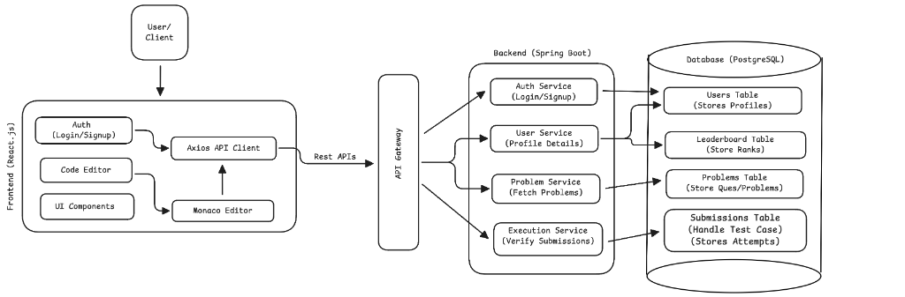

# System Design

This document outlines the high-level system architecture for the Base Mint platform, illustrating the flow of data and interactions between various components.

## Architecture Overview

The system follows a microservices architecture, separated into a React.js frontend, an API Gateway, Spring Boot backend services, and a PostgreSQL database.

### 1. Frontend (React.js)

The client-side application is built with React.js and serves as the interface for users. Key modules include:

- **Auth (Login/Signup)**: Handles user authentication interfaces.
- **Code Editor**: A programming interface integrating **Monaco Editor** for code writing.
- **UI Components**: Reusable interface elements.
- **Axios API Client**: Manages HTTP requests to the backend via REST APIs.

### 2. API Gateway

Functions as the single entry point for all client requests, routing them to the appropriate backend microservices. This ensures a decoupled and scalable architecture.

### 3. Backend (Spring Boot)

The server-side logic is divided into distinct microservices built with Spring Boot:

- **Auth Service**: Manages user registration and login processes.
- **User Service**: Handles user profile details and related data.
- **Problem Service**: Fetches coding problems and questions.
- **Execution Service**: Verifies code submissions and handles test case execution.

### 4. Database (PostgreSQL)

A relational database stores persistent data across several tables:

- **Users Table**: Stores user profiles and credentials.
- **Leaderboard Table**: Manages user rankings and scores.
- **Problems Table**: Stores coding problems and questions.
- **Submissions Table**: Records user attempts, test case results, and submission history.
